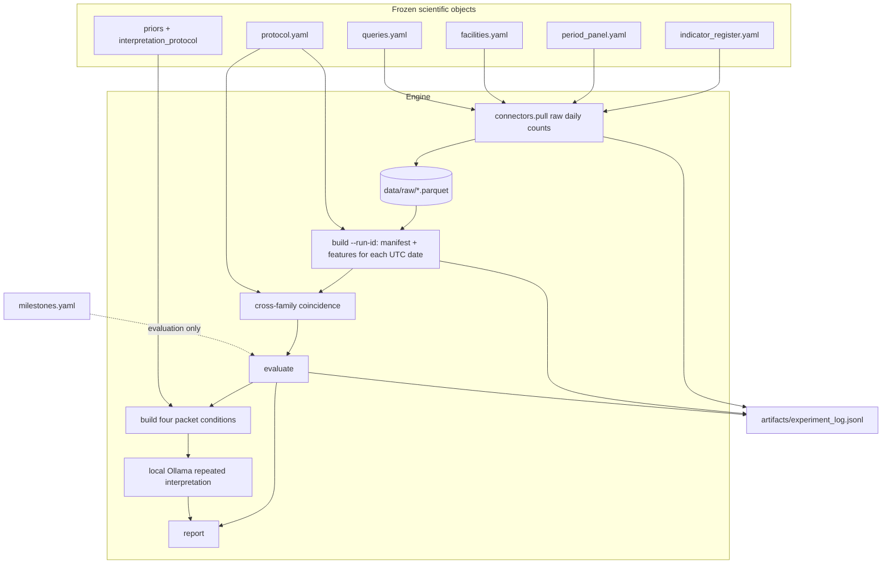

# Weak-signal fusion: a cutoff-safe panel test of correlated public indicators

**Reviewed 2026-09-05.** Initial design record; its original date and proposed architecture are retained. Current implementation is documented in [README](README.md) and [HOWTO](HOWTO.md), including the implemented Ollama analyst desk without a Chroma dependency.

| Field | Value |
|---|---|
| **Document** | Greenfield lab-notebook specification (new repository seed) |
| **Author** | [TBD] |
| **Date** | 2026-08-28 |
| **Status** | Draft (revised after measurement review) |
| **Proposed repo name** | `weak-signal-fusion` |
| **Audience** | Senior engineers implementing the first version; later readers auditing whether the test was fair |

This document is the initial design record. **Operational truth is [`README.md`](README.md) and [`HOWTO.md`](HOWTO.md).** Those files describe the current causal-domain panel, NOAA-20 FIRMS, ICEWS zip ingest, disabled Sentinel-1, and `wsd measure`. This spec still describes the v0 measurement/interpretation freeze and must not be treated as the live connector list.

---

## Overview

The north-star claim is about **strategic intent**: many individually weak public signals, including signals of absence, may become useful when correlated and interpreted in context. v0 does not pretend that intent is directly observable. Its measurable first layer is **costly preparation / capability activation / unusual mobilisation**, discriminated from quiet periods and from high-tension periods that lack that mobilisation. A second, separately scored interpretation layer asks whether those measurements change an analyst's assessment relative to an explicit historical prior.

The instrument is a small, headless Python lab notebook. Frozen YAML — indicator register, period panel, protocol, facilities, queries/titles, priors, and interpretation protocol — drives a handful of connectors into dated parquet, a cutoff-safe feature builder, one predeclared combiner, and an evaluation that scores every window with the same **frozen operating rule**. A local Ollama model (`qwen3.8:27b-mlx`) may interpret fixed evidence packets in repeated paired runs; it never creates observations or changes the deterministic alert score. Success is incremental value of the basket over the VIIRS singleton, plus honest misses and class-conditional false alerts, followed by evidence that the signal packet changes judgement beyond the prior-only packet. Success is not “it spiked in the famous war.”

v0 instantiates GDELT Events 2.0 **files** for CAMEO *activity* only, Wikimedia pageviews, ALFRED FX vintages, and VIIRS VNP46A2 night lights. **GDELT Events is not a coverage meter**; the D-notice family stays `uninstantiated` until Mentions/GKG plus a translingual rule exist. OpenSky and every other costly feed stay `uninstantiated`. Residual and covariance are computed at cutoff, never at pull.

v0 therefore tests two nested claims:

1. **Measurement:** does soft corroboration from distinct source systems improve the precision of a VIIRS anomaly?
2. **Interpretation:** does a fixed signal packet change a prior-based assessment of strategic intent in a useful and evidence-grounded direction?

This remains a fusion test with one costly gate, not a claim that any mix of weak signals detects intent. A **PR0 qualification** on real extracts must pass before `coincidence_v0` is frozen. VIIRS Collection 2 is an explicitly **retrospectively reconstructed** sensor using a declared assumed-latency regime, not a strictly contemporaneous public product.

---

## Background & Motivation

### The research claim, refined

Classic OSINT folklore is kept as **families**, not as stories:

- **Facility tempo** (“pizza to the Pentagon”): crude after-hours activity at a decision or logistics node as a “something is happening” meter. It does not say *what*. The anecdote motivates a measurable hypothesis; it is not treated as proof that the proposed indices work.
- **Coverage asymmetry / mandated silence** (D-notice class): expected reporting fails to appear in a constrained press, while an unconstrained or foreign source covers the same cluster.

Those families are instances of a broader proposition: domains that usually do not co-move start to; cheap talk diverges from costly motion; counterparts recognise something; official residue and attention move; sometimes the informative observation is that an expected series did **not** appear.

The Falklands PoC asked a different question with a different instrument: can a local LLM, given cutoff-safe extracted observations, emit a 0–6 strategic-posture distribution that separates a crisis window from a matched control? It could not. That result is informative about **that instrument**, not about fusion of timestamped public series.

### Why the old PoC is closed as an instrument

Residue, not features. Taken from `README.md`, `V2_PLAN.md` §§1–4 and 19–23, and `experiments/results/mvp_jprs_best_effort_fast_001.md`:

| Old fact | Implication for this repo |
|---|---|
| Best-effort JPRS run `mvp-jprs-best-effort-fast-001` (2026-08-27): 116 machine-bounded units; all 26 matched dates `ROUTINE`; crisis mean score **lower** than control (Δ −0.1575). | **No-go** for further investment in LLM posture scoring on analog/OCR corpora. Do not retune that pipeline. |
| Historical analog archives (OCR of 1982 newspapers, JPRS item review) consumed the resources. | Digital-native only. No OCR programme. |
| One crisis + one control cannot estimate a false-alert rate (`V2_PLAN` §4). | A **panel** of windows, including quiet baselines and high-tension non-events. |
| The 0–6 scale conflated intent, preparation, capability, and action (`V2_PLAN` §4). | Score mobilisation/activation, not intent. |
| LLM probabilities were uncalibrated; the model did more inferential work than a measurement system should. `daily-002` showed score movement with no new evidence, and empty-evidence scores ranging 0.93–1.72. | Combiner is dumb and deterministic. The LLM is a separately evaluated interpreter whose incremental value and variance are measured — never the alert score. |
| Live LLM web search encodes rankings and endings. Training data encodes endings. | No live search. Historical priors are explicit and cited. Actor masking is an ablation, not a claim that model memory has been erased. Unsupported model-memory claims are non-evidence. |
| Crisis score correlated 0.782 with observation volume (`V2_PLAN` §23). | Source volume and collection health are first-class series, not posture. |
| Thresholds fitted to famous cases are a named failure mode (`V2_PLAN` §20). | Freeze the register, panel, facilities, queries, and protocol before looking at showcase plots. Report misses. |
| Missing data interpreted as meaningful silence is a named failure mode. | Silence is illegal unless an expected baseline is declared. In v0, `expected_baselines.yaml` is empty: no series may set `silence=True`. |
| Counterpart reaction mistaken for focal intent is a named failure mode. | Dyadic series are labelled **counterpart recognition**. |
| Acceptance should not be “narrates a famous crisis” (`V2_PLAN` §22). | Lead with basket-versus-VIIRS, false alerts, and prior-plus-signals versus prior-only, not a Ukraine 2022 narrative. |

What is worth keeping, as **constraints**:

1. **Cutoff-safe evidence.** A point is eligible at analysis time `t` only if its public as-of time is `≤ t`. Enforced in code, not in comments.
2. **Matched / non-event controls.** Quiet and high-tension-without-mobilisation windows are first-class, not afterthoughts.
3. **Do not retune after the showcase.** Protocol hash is recorded; a changed protocol is a new run.
4. **Write down no-gos.** Negative results stay in the notebook.
5. **Missingness ≠ silence.**
6. **Ground truth structurally isolated** from feature computation.
7. **Append-only experiment log.**
8. **Sustained detection requires persistence**, not a one-day spike.

### Pain this repo is built to avoid

- Building a platform before a measurement exists.
- Spending a year on archives that cannot test the fusion claim.
- Letting an LLM be the instrument.
- Declaring victory from one famous mobilisation.

---

## Goals & Non-Goals

### Goals

1. Run **PR0 measurement qualification** on real extracts for one quiet window, one hard negative, and one development positive **before** freezing `coincidence_v0` or building the remaining PRs.
2. Freeze a named **indicator register** (families → digital instantiations or explicit `uninstantiated`) before inspecting showcase outcomes. PR 1 copies the YAML in this spec verbatim **after** PR0.
3. Freeze a deliberately small **five-window decision panel**: one long quiet baseline, one development hard negative, one development mobilisation-positive, one held-out hard negative, and one held-out positive. Expansion to more actors is contingent on a useful PoC result.
4. Ingest bitemporal raw observations: `event_time`, `available_at` (this version), `retrieved_at`, immutable `version_id`. Never overwrite. Store **raw daily counts**, not derived z.
5. Compute features from the latest version with `available_at <= cutoff`. Select the current observation first; the baseline is strictly **preceding** that observation.
6. Combine with a dumb rule: trailing z-scores + coincidence requiring **k distinct families and k distinct source systems**, of which `k_costly` are costly, with persistence. No logistic in v0.
7. Evaluate with a predeclared **detection horizon** and **target interval**. Out-of-horizon alerts are false alerts even inside positive windows. Same frozen operating rule, not an equal-FAR comparison.
8. Ship a repo a single person can run: six CLI commands with a complete `--run-id` loop, pytest for cutoff / register completeness / “duds are reported.”
9. Generate fixed evidence packets and run four interpretation conditions: base-rate, prior-only, signals-only with role masking, and prior-plus-signals.
10. Use the local `qwen3.8:27b-mlx` Ollama model in deterministic, batchable repeated runs. Optimise for unattended throughput and resumability, not interactive latency.

### Non-goals (explicit)

- Not a redesign or continuation of `signal-detector`.
- Not MongoDB, graph DB, vector index, HTML research portal, Docker swarm, or a harness matrix.
- Not 7-state LLM posture scores, JPRS/OCR review queues, or a “v2 platform.”
- Not live operational alerting, targeting, or collection against current sensitive operations beyond ordinary public APIs used retrospectively.
- Not a calibrated intent classifier. The AI layer produces evidence-grounded hypothesis comparisons and changes from a prior, not operational probabilities.
- Not filling `uninstantiated` families by starting an archive or scraping ToS-hostile sources.
- Not threshold fishing, post-hoc facility picking on known staging bases, or dropping duds from the report.
- Not using Ukraine 2022 as the tuning case.
- Not OpenSky, NOTAMs, AIS, or GDELT DOC as v0 dependencies. PR0 may select either logged bulk Events files or a bounded BigQuery Events query after measuring transfer, query bytes, elapsed time, and monetary cost; the selected access path is then frozen.
- Not treating GDELT Events `SOURCEURL` as a press-coverage / D-notice meter.
- Not treating Collection 2 VIIRS as a contemporaneously public product without saying so.
- Not a fitted logistic combiner in v0 (`evaluate` refuses `logistic: true`).
- Not a dashboard in v0. Machine-readable alerts and evidence packets are the future dashboard contract; no frontend is built until the headless measurement has value.

---

## Key Decisions

1. **New repo, digital-native panel.** The fusion claim does not require 1982 paper. Analog collection is what starved the last instrument.
2. **Measured target = mobilisation / costly activation; north-star = intent triage.** High-tension-without-mobilisation windows are hard negatives; aborted buildups are positives even if no war follows. Intent is assessed only in the separate interpretation experiment.
3. **Scientific objects are YAML, not code.** `config/{indicator_register,period_panel,protocol,facilities,queries,milestones,expected_baselines,priors,interpretation_protocol}.yaml` are the experiment. PR 1 materialises them **after** PR0 qualification.
4. **Uninstantiated stays uninstantiated.** A family with no valid public timestamped source remains in the register with a reason. No fake series, no OCR, no Events-as-coverage.
5. **Dumb combiner first; no logistic in v0.** Trailing z-score + coincidence + persistence. `evaluate` raises if `protocol.logistic` is true. The LLM is not a combiner and cannot change a flag or alert.
6. **Coincidence is cross-family *and* cross-source.** Default: `k=3` flags from **3 distinct `Family` values** and **3 distinct `source_system` values**, of which `k_costly=1` is costly, persisting `p=3` days. One series per register id. `fusion.domain_covar` and `talk_vs_motion.residual` **must not** vote. Coverage gap does **not** vote in v0 because it is uninstantiated.
7. **v0 claim is narrower than the north-star fusion claim.** With VIIRS as the only costly series, every basket alert requires it. The honest test is: *does soft corroboration from other source systems improve VIIRS precision?* Report source-system diversity on every episode. Do not advertise “many independent weak signals” if two votes share a GDELT pipeline.
8. **Ukraine 2022 is held-out positive; `GRC-TUR-2020` is held-out hard negative.** Titles/queries for `RUS-2022` are generic MoD + capitals + toponyms from the period’s public name, not 2022 coverage language. Additional geographies remain candidate expansion cases only and are not pulled in v0.
9. **Raw observations are bitemporal and immutable.** `event_time` (what the value describes), `available_at` (when *this version* became public), `retrieved_at` (when we obtained it), `version_id`. Never overwrite. Features use the latest version with `available_at <= cutoff`. FRED/ALFRED must request historical vintages, not “information available today.”
10. **Silence requires a declared expected baseline.** v0 `expected_baselines.yaml` is an empty list. Only absence-family rows may ever set `silence=True`.
11. **Milestones are evaluation-only** and are **intervals with provenance**, not a single convenient date. Feature code cannot import them.
12. **v0 connectors: GDELT Events (talk only), Wikimedia, ALFRED, VIIRS.** VIIRS is the single costly instantiation and is **retrospectively reconstructed** (Collection 2) under `availability_regime: reconstructed_assumed_latency`. OpenSky stays `uninstantiated`. Live VIIRS is optional; committed daily parquet is required.
13. **Python 3.12+, uv, Pydantic v2, parquet, matplotlib, pytest.** No services. Optional extra `viirs`.
14. **Every scientific input is part of run identity.** Changing register, panel, facilities, queries, milestones, expected baselines, priors, interpretation protocol, or measurement protocol without a new `run_id` is an error.
15. **Current observation first, then preceding baseline, with freshness enforced.** Cutoff instant is end-of-UTC-day. Current point = the expected event date for that series at cutoff, after declared latency/cadence is applied, using the last eligible version with `available_at <= cutoff_instant(D)`. Baseline uses eligible versions whose `event_time` is strictly before the current point. An older observation is never reused as a new daily flag; if the expected point is absent, that cutoff is missing.
16. **Returns do not carry across non-print days.** FRED abs log-return is missing (cannot flag) on weekends/holidays. Carry-forward is legal for a *level*, not for a *change*. Persistence therefore cannot be manufactured by repeating Friday’s shock.
17. **Detection uses a horizon and a target interval.** Default `detection_horizon_days: 30`. Hit iff episode onset ∈ `[target_start − 30d, target_end]`. Alerts outside that interval are **false alerts**, including inside positive windows. Comparison is the **same frozen operating rule**, not equal FAR.
18. **PR0 before freeze.** Real extracts for `DEU-2018-quiet`, `USA-CHN-2018-trade`, and `RUS-2021-apr`. Apply predeclared source-quality and acquisition-cost gates. Ukraine 2022 and GRC-TUR-2020 remain untouched.
19. **AI interpretation is a paired ablation, not a disguised score.** Four conditions are frozen: base-rate, prior-only, masked signals-only, and prior-plus-signals. Actor masking isolates signal content; actor-aware explicit priors preserve relevant history. The primary AI comparison is prior-plus-signals versus prior-only.
20. **Local-model economics shape the harness.** `qwen3.8:27b-mlx` runs through Ollama with `temperature: 0`, a fixed seed where supported, bounded output, retained model residency for warm batches, checkpointed JSONL, and repeated runs. Slow execution is acceptable; unrecoverable or interactive-only execution is not.
21. **AI assistance is recorded.** AI may propose corpus candidates, write code, generate synthetic fixtures, and draft tests. Every scientific choice needs a cited rule and an acceptance record made before outcome-bearing plots. AI-generated expected test results must come from declared invariants or independent fixtures, not from the implementation under test.

---

## Proposed Design

### Repository layout

A single package `wsf`, config as data, tiny CLI:

```text
weak-signal-fusion/
  README.md
  pyproject.toml
  config/
    indicator_register.yaml
    period_panel.yaml
    protocol.yaml
    facilities.yaml              # ≤3 AOIs per focal actor; bbox + timezone
    queries.yaml                 # domains, FIPS, CAMEO, wiki titles, FRED ids
    expected_baselines.yaml      # v0: empty list
    milestones.yaml              # evaluation-only
    priors.yaml                  # cited cutoff-safe actor/context prior packets
    interpretation_protocol.yaml # four AI conditions + fixed local-model settings
  src/wsf/
    __init__.py
    types.py
    register.py
    protocol.py                  # load + canonical sha256
    time.py                      # cutoff_instant, date ranges
    log.py                       # append-only experiment_log.jsonl
    connectors/
      base.py                    # Connector + PullRequest (ships in PR 1)
      gdelt.py                   # Events 2.0 files → daily counts
      wikipedia.py
      viirs.py                   # optional live; fixtures always
      fred.py
    features/
      cutoff.py
      baseline.py
      zscore.py
      gap.py                     # algorithm for a later Mentions/GKG protocol; not wired in v0
      coincidence.py
      covariance.py
      residual.py                # talk_vs_motion
      absence.py
    evaluate.py
    packets.py                   # immutable evidence packets; no milestones
    interpret.py                 # local Ollama paired/repeated runs
    report.py
    cli.py
  data/
    raw/                         # gitignored parquet
    fixtures/                    # committed daily counts (incl. VIIRS)
    corpus/                      # provenance, label sources, accepted/rejected candidates
  tests/
    test_cutoff.py
    test_register.py
    test_report_completeness.py
    test_absence_vs_missing.py
    test_milestone_isolation.py
    test_protocol_hash.py
    test_coincidence.py
    test_freshness.py
    test_packet_isolation.py
    test_interpretation_contract.py
  artifacts/                     # gitignored
  experiments/
    assistance_log.jsonl         # AI task, inputs, output/diff, acceptance decision
  NOGOS.md
```

No `compose.yaml`. No generic prompt matrix. No `opensky.py` in v0. Local parquet is the store. The interpretation prompt is a versioned scientific object, not an exploratory prompt directory.

### Runtime architecture



### Cutoff data flow

```mermaid
sequenceDiagram
  participant CLI
  participant Build as Feature builder
  participant Parquet
  participant Comb as Combiner
  participant Eval as Evaluator

  CLI->>Build: build --run-id RUN [--period ID]
  Build->>Build: if no manifest: hash YAML, write manifest.json
  loop each period, each UTC date D in [start, end]
    Build->>Parquet: latest version with available_at <= cutoff_instant(D)
    Parquet-->>Build: observations including lookback
    Build->>Build: current first; baseline event_time < current.event_time; z; residual/covar
  end
  Note over Build: lookback days feed μ/σ; they are not scored as alerts
  CLI->>Eval: evaluate --run-id RUN
  Eval->>Eval: refuse if YAML hash ≠ manifest
  Eval->>Comb: flags + persistence per D
  Eval->>Eval: load milestones after scoring
  Eval-->>CLI: hit / miss / FAR by class (out-of-horizon = FAR)
```

### Frozen protocol (`config/protocol.yaml`)

PR 1 materialises this protocol after PR0. Tables in this draft are normative inputs, but generated YAML must pass schema validation and canonical-hash tests; “verbatim” does not override a required correction recorded by PR0.

```yaml
protocol_id: coincidence_v0
window_days: 90
n_min: 20
z_threshold: 2.5
k: 3
k_costly: 1
k_distinct_families: true
k_distinct_source_systems: true
detection_horizon_days: 30
persistence_days: 3
logistic: false
z_motion: max_costly_tempo_or_motion   # max z among in-basket costly series in families facility_tempo or cheap_talk_vs_costly_motion
covar_short_days: 14                   # corr_t window
covar_short_min_n: 10
covar_baseline_min_n: 20
covar_pair_baseline_abs_max: 0.2
empty_covar: missing                   # not 0
gap_nested_mu: false                   # Example A: one μ_A, μ_B at D; apply to every baseline day
cutoff: utc_end_of_day                 # date D → 23:59:59 UTC
fred_non_trading: missing              # return series: non-print days are missing (cannot flag); do not carry Friday's return
yaml_hash:
  encoding: utf-8
  form: json.dumps(normalize_yaml_scalars(yaml.safe_load(text)), sort_keys=True, separators=[',', ':'])
declared_latencies:                    # fallbacks when the vendor gives no version timestamp
  gdelt: 0d                            # DATEADDED/zip date
  wikipedia: 1d
  viirs: reconstructed                 # Collection 2: not contemporaneous; see VIIRS connector
  fred: alfred_vintage                 # available_at = vintage date from ALFRED, not +1d guess
aggregation:
  wiki: sum_titles
  viirs: mean_of_aoi_means
  viirs_min_valid_aois: 2
  gdelt: daily_row_count
adsb_night:                            # recorded for later OpenSky instantiation; unused in v0
  local_start: "20:00"
  local_end: "05:00"
  event_date: night_of_start           # 20:00 D → 05:00 D+1 has event_time date D
heavy_icao_types: ["C17", "IL76", "A400", "A124", "C5", "C130", "K35R", "C30J"]
heavy_wake_fallback: H
pull_on_value_change: never_overwrite  # insert a new version; never mutate an existing version_id
viirs_cutoff_status: retrospectively_reconstructed
viirs_availability_regime: reconstructed_assumed_latency
viirs_assumed_latency_days: 3
freshness:
  gdelt: {cadence: daily, expected_lag_days: 0, max_age_days: 0}
  wikipedia: {cadence: daily, expected_lag_days: 1, max_age_days: 0}
  viirs: {cadence: daily, expected_lag_days: 3, max_age_days: 0}
  fred: {cadence: fed_h10_print_days, expected_lag_days: 0, max_age_days: 0}
```

`normalize_yaml_scalars` recursively converts dates, datetimes, enums, and other schema-approved scalar objects to their canonical string representation before JSON encoding. Hashing raw `safe_load` output is forbidden because unquoted YAML dates are not JSON serializable consistently.

`evaluate` **refuses** `logistic: true`. Mobilisation labels are the `target_start`/`target_end` intervals in `milestones.yaml`, with citations. There is no per-day mobilisation label set.

### Core types

`src/wsf/types.py` is the contract. Pydantic v2. Validators **`raise ValueError`**, never `assert` (asserts die under `python -O`).

```python
from datetime import date, datetime
from enum import Enum
from typing import Literal
from pydantic import BaseModel, Field, model_validator

NON_VOTING_DERIVED = frozenset({"fusion.domain_covar", "talk_vs_motion.residual"})

class Family(str, Enum):
    facility_tempo = "facility_tempo"
    coverage_asymmetry = "coverage_asymmetry"
    cheap_talk_vs_costly_motion = "cheap_talk_vs_costly_motion"
    cross_domain_covariance = "cross_domain_covariance"
    dyadic_counterpart = "dyadic_counterpart"
    official_residue = "official_residue"
    attention_without_admission = "attention_without_admission"
    absence_as_absence = "absence_as_absence"

class IndicatorStatus(str, Enum):
    instantiated = "instantiated"
    uninstantiated = "uninstantiated"
    derived = "derived"

class CostClass(str, Enum):
    costly = "costly"
    soft = "soft"
    info = "info"

class Polarity(str, Enum):
    high_unusual = "high_unusual"
    low_unusual = "low_unusual"
    either = "either"

class IndicatorSpec(BaseModel):
    id: str
    family: Family
    hypothesis: str
    status: IndicatorStatus
    cost_class: CostClass
    polarity: Polarity = Polarity.high_unusual
    in_basket: bool
    source_system: str | None = None  # e.g. gdelt_events, wikipedia, alfred, viirs_c2
    connector: str | None = None
    series_id: str | None = None
    computed_from: list[str] = Field(default_factory=list)
    uninstantiated_reason: str | None = None
    expected_baseline_id: str | None = None
    notes: str = ""

    @model_validator(mode="after")
    def status_consistent(self):
        if self.status is IndicatorStatus.instantiated:
            if not (self.connector and self.series_id and self.source_system):
                raise ValueError(f"{self.id}: instantiated requires connector, series_id, source_system")
            if self.family is Family.absence_as_absence and not self.expected_baseline_id:
                raise ValueError(f"{self.id}: absence requires expected_baseline_id")
        elif self.status is IndicatorStatus.derived:
            if self.connector is not None:
                raise ValueError(f"{self.id}: derived must not have a connector")
            if not self.series_id or not self.computed_from:
                raise ValueError(f"{self.id}: derived requires series_id and computed_from")
            if self.id in NON_VOTING_DERIVED and self.in_basket:
                raise ValueError(f"{self.id}: residual/covar singletons cannot vote")
        else:
            if not self.uninstantiated_reason:
                raise ValueError(f"{self.id}: uninstantiated requires a reason")
            if self.connector is not None or self.in_basket:
                raise ValueError(f"{self.id}: uninstantiated cannot connect or vote")
        return self

class PeriodClass(str, Enum):
    quiet = "quiet"
    high_tension_non_mobilisation = "high_tension_non_mobilisation"
    mobilisation_reversed = "mobilisation_reversed"
    overt_action = "overt_action"

class Split(str, Enum):
    development = "development"
    held_out = "held_out"

class PeriodWindow(BaseModel):
    id: str
    focal_actor: str
    counterpart_actor: str | None = None
    period_class: PeriodClass
    split: Split
    start: date
    end: date
    lookback_start: date          # start - 120d
    query_id: str                 # key in queries.yaml; equal to id
    notes: str = ""

class PullRequest(BaseModel):
    period_id: str
    series_id: str
    focal_actor: str
    start: datetime               # lookback_start 00:00 UTC
    end: datetime                 # period.end 23:59:59 UTC
    query_hash: str               # sha256 of the period's queries.yaml slice
    aoi_ids: list[str]

class Observation(BaseModel):
    """Immutable raw version. Identity is version_id, never (series, event_time) alone."""
    version_id: str               # stable hash of series_id, event_time, available_at, value
    series_id: str
    period_id: str
    event_time: datetime          # what date the measurement describes
    available_at: datetime        # public time, or named assumed-latency time for reconstructed series
    retrieved_at: datetime        # when this system obtained it
    value: float | None
    quality: Literal["ok", "missing", "source_down"]
    extra: str = "{}"             # JSON object serialized to string (parquet UTF8)

class FeatureRow(BaseModel):
    period_id: str
    series_id: str
    cutoff: date
    expected_event_date: date     # cadence/latency-derived date required at this cutoff
    current_event_time: datetime | None
    age_days: int | None
    raw: float | None
    baseline_mu: float | None
    baseline_sigma: float | None
    n_baseline: int
    z: float | None
    missing: bool
    silence: bool                 # v0: always False (empty expected_baselines)
    flagged: bool

class Alert(BaseModel):
    period_id: str
    start: date                   # first day persistence holds
    end: date                     # last day persistence still holds
    n_flagged: int
    n_costly_flagged: int
    contributing_families: list[str]
    contributing_source_systems: list[str]
    contributing_series: list[str]
```

Connector interface:

```python
class Connector(Protocol):
    id: str
    def pull(self, req: PullRequest) -> list[Observation]:
        """Raw daily (or nightly) counts as new Observation versions.
        available_at from vendor vintage or a named declared-latency regime.
        Never mutate an existing version_id. Aggregate AOIs/titles into one series_id."""
        ...
```

### Cutoff-safe feature builder

```python
from datetime import datetime, time, timedelta
from zoneinfo import ZoneInfo

UTC = ZoneInfo("UTC")

def cutoff_instant(d: date) -> datetime:
    return datetime.combine(d, time(23, 59, 59), tzinfo=UTC)

def eligible_version(obs: Observation, cutoff: datetime) -> bool:
    """This version was public at cutoff. Supersession does not hide an older version
    unless a newer version also has available_at <= cutoff (see as_of_value)."""
    return obs.available_at <= cutoff


def as_of_value(versions: list[Observation], cutoff: datetime) -> Observation | None:
    """Latest version of a (series, event_time) whose available_at <= cutoff."""
    visible = [v for v in versions if v.available_at <= cutoff]
    if not visible:
        return None
    return max(visible, key=lambda v: (v.available_at, v.version_id))
```

**Daily loop (this is the engine):** `wsf build --run-id RUN` for each selected period, for each calendar date `D` in `[period.start, period.end]` inclusive, builds one feature row per in-scope series at `cutoff_instant(D)`. Lookback observations are pulled and used for μ/σ. They are **not** scored for flags or alerts.

**Expected current then baseline** (do not put the scored point in its own baseline and do not carry stale anomalies):

1. Derive `expected_event_date(D, series)` from the frozen cadence and latency table. Examples: GDELT expects `D`; Wikipedia expects `D−1`; reconstructed VIIRS expects `D−3`; FRED expects `D` only when `D` is a print day.
2. For that exact expected event date, choose `as_of_value` using versions with `available_at <= cutoff_instant(D)`. If there is no eligible healthy observation for that date, emit `missing=True`, `flagged=False`. Do **not** fall back to the latest older event time.
3. **Baseline** = `as_of_value` for each distinct `event_time` strictly before the current observation, still with `available_at <= cutoff_instant(D)`, restricted to the trailing `W` calendar days (`n_min` applies to this set).
4. `z = (current.value - μ) / σ` on that preceding baseline.

A one-day-lagged Wikipedia print that becomes available at 00:00 on `D` is current at cutoff `D`; it is not in its own baseline. A missing Wikipedia print does not cause yesterday's value to be rescored. The same no-stale-carry rule applies to GDELT and VIIRS. FRED levels are selected as-of; the return is derived only for actual print days.

Other rules:

- **Never** filter eligibility on `event_time` alone. Publicness is `available_at`.
- When a contemporaneous vendor publishes a vintage timestamp, that is `available_at`. Wikipedia uses its declared one-day latency. VIIRS Collection 2 is the explicit exception: v0 assigns `available_at = event_time + 3d` under the frozen reconstructed assumed-latency regime and stores the actual later production timestamp in `extra`. Unknown latency outside an explicitly named reconstruction regime → `uninstantiated`.
- `z` if `n_baseline >= n_min` and `σ > 0`; else `missing=True`, `z=None`, `flagged=False`. **Missing does not flag.**
- Imputation of z is forbidden. FRED **returns** on non-print days are `missing`, not carried Friday returns.
- Tests: (a) a version with `available_at = cutoff_instant(D) + 1s` cannot affect `z` at `D`; (b) the current observation is excluded from μ/σ; (c) a later revision with `available_at` after cutoff cannot replace the vintage visible at cutoff; (d) one anomalous observation followed by two absent expected observations cannot satisfy three-day persistence; (e) partial-title/AOI aggregates follow the frozen completeness rule.

### Combiner

**Flag** an `in_basket` series on day `D` if `z` exists and exceeds `z_threshold` in the declared polarity.

**Basket condition** on day `D`: the set of flagged `in_basket` series that day has

1. size ≥ `k`,
2. **≥ `k` distinct `Family` values**,
3. **≥ `k` distinct `source_system` values** (`k_distinct_source_systems`),
4. ≥ `k_costly` series with `cost_class: costly`.

`k_distinct_families` stops three tempo clones. `k_distinct_source_systems` stops GDELT talk + GDELT coverage (if coverage is later instantiated from the same Events files) from counting as two independent votes. Three AOI clones of VIIRS cannot vote three times: they are one series id.

Every v0 basket alert still requires VIIRS. Report `contributing_source_systems` on every episode. The honest caption is soft corroboration of a VIIRS anomaly, not unconstrained multi-sensor fusion.

**Episode rule**

- Onset `start` = first date on which the basket condition held for each of the last `persistence_days` dates (confirmation day).
- `end` = last date on which the basket condition still holds (the last confirmation day, not the following unflagged day).
- A gap of ≥ 1 date where the basket condition fails **starts a new episode**. No hole-filling.
- Lookback dates never appear as `Alert.start`.

Worked numbers: flags on days 4–7, unflagged on 8, `p=3` → condition holds on days 6 and 7. One episode `[6, 7]`. FAR counts **episodes**, not days. That is one false-alert episode if the window is a negative class.

`z_motion` (for the residual singleton) = max z among instantiated **in-basket** costly series whose family is `facility_tempo` or `cheap_talk_vs_costly_motion`. In v0 that is `tempo.viirs_aoi` alone. If that z is missing, residual is missing.

### Cross-domain covariance (family 4)

Domains are `(family, cost_class)` pairs, not family alone (family 3 must not average talk with motion). For each cutoff `D`, mean z of non-missing in-basket series in that domain. **Two windows** (if both use trailing-W, `corr_t − corr_baseline` is ~0 by construction):

- `corr_t`: Pearson over the last `covar_short_days` (14) **eligible** days with `available_at <= cutoff_instant(D)`.
- `corr_baseline`: Pearson over `[D − W, D − covar_short_days)` eligible days.
- The short leg needs `n >= covar_short_min_n` distinct days; the baseline leg needs `n >= covar_baseline_min_n`. Otherwise that pair is missing. These minima are separate because the 14-day short leg cannot satisfy the z-score baseline minimum of 20.

```text
pairs = {(d1,d2) : |corr_baseline(d1,d2)| < covar_pair_baseline_abs_max
                 and n_short >= covar_short_min_n
                 and n_baseline >= covar_baseline_min_n}
covar_t = mean({corr_t(d1,d2) − corr_baseline(d1,d2) for (d1,d2) in pairs})
```

If `pairs` is empty, `covar_t` is **missing**, not 0. Scored only as a singleton (`in_basket: false`).

### Distinguishing missingness from silence

| Condition | `quality` | `missing` | `silence` | can flag? |
|---|---|---|---|---|
| Source returned a complete aggregate, `available_at ≤ cutoff` | `ok` | false | false | via z |
| Connector failed, quota, coverage hole, incomplete title set, fewer than 2 valid VIIRS AOIs, `n_baseline < n_min` | `missing` / `source_down` | true | false | no |
| Absence-family row with a declared expected baseline, connector healthy, expected event absent | `ok` value 0 | false | **true** | via that row’s polarity |

**v0:** `expected_baselines.yaml: []`. No absence row is instantiated. **`silence` is always false.** Example A day 7 is a **gap** flag, not silence.

### CLI (six commands, complete run loop)

```bash
uv run wsf doctor
uv run wsf pull     --run-id RUN [--period ID] [--indicator ID]
uv run wsf build    --run-id RUN [--period ID]
uv run wsf evaluate --run-id RUN [--split development|held_out|all]
uv run wsf interpret --run-id RUN [--condition CONDITION] [--repeats N] [--resume]
uv run wsf report   --run-id RUN
```

- `doctor`: validates every YAML block in this spec (families present, freeze hashes of facilities/queries, derived rows have `computed_from`, coverage rows are uninstantiated, `fusion.domain_covar` and `talk_vs_motion.residual` have `in_basket: false`, instantiated rows have `source_system`, absence rows need baselines). Checks env for live connectors. No network required for schema checks.
- `pull --run-id RUN`: writes `data/raw/series_id=…/period_id=…/dt=…parquet` and `artifacts/<run>/harvest_manifest.json`. Identity is `version_id`. If a later harvest yields a different value for the same event time, insert a new version with the vendor vintage and retrieval time. Never overwrite or mutate an old row; supersession is derived at read time.
- `build --run-id RUN`: if `artifacts/<run>/manifest.json` is absent, hash every scientific YAML object with the canonical normalized JSON dump, write the manifest, append to `artifacts/experiment_log.jsonl`. Then loop cutoffs as above into `artifacts/<run>/features.parquet`. Refuses to clobber a manifest whose hash does not match current YAML.
- `evaluate --run-id RUN`: reads that run’s features + manifest; refuses hash mismatch; refuses `logistic: true`; loads milestones **here only**; writes `alerts.parquet`.
- `interpret --run-id RUN`: creates immutable packets, calls local Ollama in the four frozen conditions, records raw responses and native timing/token metrics, and resumes by packet/condition/repeat identity. It cannot import milestones or modify features/alerts.
- `report --run-id RUN`: tables and plots in §Outputs.

No profile matrix, no placebo harness, no seed sweep.

---

## Frozen YAML (PR 1 copies verbatim)

This freeze is the science. Changing a bbox, domain, title, FIPS list, or CAMEO code is a new protocol/register hash, not a silent edit after plots.

### `config/facilities.yaml`

Rule, applied once: per **focal** actor, at most **3** AOIs — capital government box, primary civil airport (`OurAirports` `type=large_airport` for that ISO), ministry-of-defence HQ (OSM `office=government` / named MoD). **Not** `type=military` dump, **not** known staging fields (Yelnya, Millerovo, …). Bboxes are `[min_lon, min_lat, max_lon, max_lat]`. Timezone is IANA, used only if a later OpenSky night window is instantiated.

```yaml
generation:
  gazetteer: OurAirports + OSM
  retrieved: 2026-08-28
  rule: capital + large_airport + mod_hq
  max_aois_per_focal: 3
actors:
  DEU:
    timezone: Europe/Berlin
    aois:
      - id: DEU-capital
        name: Berlin government district
        kind: capital
        bbox: [13.35, 52.50, 13.45, 52.53]
      - id: DEU-airport
        name: Berlin Brandenburg
        icao: EDDB
        kind: civil_airport
        bbox: [13.48, 52.35, 13.55, 52.39]
      - id: DEU-mod
        name: BMVg Hardthöhe Bonn
        kind: mod_hq
        bbox: [7.10, 50.698, 7.155, 50.735]
  USA:
    timezone: America/New_York
    aois:
      - id: USA-capital
        name: National Mall government
        kind: capital
        bbox: [-77.06, 38.87, -77.00, 38.90]
      - id: USA-airport
        name: Ronald Reagan Washington National
        icao: KDCA
        kind: civil_airport
        bbox: [-77.06, 38.84, -77.03, 38.86]
      - id: USA-mod
        name: Pentagon
        kind: mod_hq
        bbox: [-77.07, 38.86, -77.04, 38.88]
  GRC:
    timezone: Europe/Athens
    aois:
      - id: GRC-capital
        name: Athens Syntagma-Maximos
        kind: capital
        bbox: [23.73, 37.97, 23.74, 37.98]
      - id: GRC-airport
        name: Athens International
        icao: LGAV
        kind: civil_airport
        bbox: [23.92, 37.92, 23.97, 37.95]
      - id: GRC-mod
        name: Hellenic MoD Papagou
        kind: mod_hq
        bbox: [23.78, 37.99, 23.81, 38.01]
  RUS:
    timezone: Europe/Moscow
    aois:
      - id: RUS-capital
        name: Kremlin-Kitay-gorod government
        kind: capital
        bbox: [37.60, 55.74, 37.63, 55.76]
      - id: RUS-airport
        name: Sheremetyevo
        icao: UUEE
        kind: civil_airport
        bbox: [37.39, 55.96, 37.44, 55.99]
      - id: RUS-mod
        name: MoD Znamenka
        kind: mod_hq
        bbox: [37.58, 55.73, 37.60, 55.74]
```

USA-CHN uses **USA** AOIs (focal). Counterpart CHN AOIs are not pulled unless a later protocol adds counterpart tempo (it does not, in v0). `tempo.viirs_aoi` for `USA-CHN-2018-trade` is US capital/airport/MoD night lights — a hard-negative check, not a China-staging hunt.

### `config/queries.yaml`

GDELT input is **Events 2.0 English data**, using the PR0-frozen bulk or BigQuery path—not DOC and not a mixed English-plus-translation pull that would double-count. Coverage and talk use **different country-code systems**:

- `cluster_fips`: 2-letter FIPS-10, matched only to `ActionGeo_CountryCode`.
- `talk_actor1`: 3-letter CAMEO, matched only to `Actor1CountryCode`.

Coverage = `SOURCEURL` host in the domain list **and** `ActionGeo_CountryCode ∈ cluster_fips`. Hosts are lowercased and leading `www.` stripped. Talk = `Actor1CountryCode = talk_actor1` and `EventRootCode` in the frozen talk set. Wiki is the English title list. FRED is one series id or `null` (then `dyad.fx` is missing for that period, still reported). There is no daily H.10 ruble; RUS periods are `null`.

Held-out `RUS-2022` titles are MoD + capitals + toponyms. They do **not** include “Russian invasion of Ukraine”, “2021–2022 Russo-Ukrainian crisis”, or any article whose current name encodes the ending.

```yaml
unconstrained_domains:   # basket B, all periods
  - nytimes.com
  - washingtonpost.com
  - bbc.co.uk
  - theguardian.com
  - reuters.com
  - apnews.com
  - lemonde.fr
  - dw.com
cameo_talk_root_codes: ["01", "02", "04", "13"]   # statement, appeal, consult, threaten
periods:
  DEU-2018-quiet:
    cluster_fips: ["GM"]
    talk_actor1: DEU
    A_domains: [spiegel.de, faz.net, zeit.de, bild.de, tagesschau.de]
    wiki_titles: [Bundesministerium der Verteidigung, Berlin, Bundeswehr]
    fred_series: DEXUSEU
  USA-CHN-2018-trade:
    cluster_fips: ["US", "CH"]
    talk_actor1: USA
    A_domains: [nytimes.com, washingtonpost.com, wsj.com, cnn.com, foxnews.com]
    wiki_titles: [United States Department of Defense, The Pentagon, Ministry of National Defense of the People's Republic of China]
    fred_series: DEXCHUS
  GRC-TUR-2020:
    cluster_fips: ["GR", "TU"]
    talk_actor1: GRC
    A_domains: [ekathimerini.com, protothema.gr, kathimerini.gr, naftemporiki.gr]
    wiki_titles: [Hellenic Ministry of National Defence, Athens, Turkish Armed Forces]
    fred_series: DEXUSEU
  RUS-2021-apr:
    cluster_fips: ["RS", "UP"]
    talk_actor1: RUS
    A_domains: [tass.com, ria.ru, rt.com, kommersant.ru, iz.ru]
    wiki_titles: [Ministry of Defence (Russia), Moscow, Kremlin, Ukraine, Kyiv]
    fred_series: null          # no H.10 daily ruble; dud row, still reported
  RUS-2022:
    cluster_fips: ["RS", "UP"]
    talk_actor1: RUS
    A_domains: [tass.com, ria.ru, rt.com, kommersant.ru, iz.ru]
    wiki_titles: [Ministry of Defence (Russia), Moscow, Kremlin, Ukraine, Kyiv]
    fred_series: null          # no H.10 daily ruble; dud row, still reported
```

`USA-CHN-2018-trade` A_domains remain in `queries.yaml` for a later coverage protocol. They are unused in v0.

### `config/expected_baselines.yaml`

```yaml
[]
```

### `config/milestones.yaml`

```yaml
# Intervals, not a single convenient day. Provenance is required.
# Hit iff Alert.start ∈ [target_start - detection_horizon_days, target_end].
# Any other episode in the window is a false alert, including early positives.
RUS-2021-apr:
  target_start: 2021-03-25
  target_end: 2021-04-08
  provenance:
    - {citation: "ISW Russia Team, April 2021 assessments of the spring buildup", url: "https://www.understandingwar.org"}
  markers:
    - {date: 2021-04-22, role: reversal_plot_only}
RUS-2022:
  target_start: 2022-02-10
  target_end: 2022-02-24
  provenance:
    - {citation: "UNSC / public record of the 24 Feb 2022 invasion", url: "https://press.un.org/en/2022/sc14803.doc.htm"}
# quiet and high_tension_non_mobilisation: no target; every episode is a false alert
```

Fill `url` with a specific public source **in PR1**, not after looking at z-plots. Empty url fails `doctor`. Horizon default is 30 days (`protocol.yaml`). A RUS-2021 episode after `target_end` and before window end is a **false alert**, not “late credit.” Optional `late` is reserved for onsets in `(target_end, target_end + 7d]` if a later protocol wants a grace band; v0 has **no late bucket** — outside the interval is FAR.

---

## Indicator register

Frozen **before** plots. Families are mandatory rows. Instantiations below are the v0 defaults.

**Cardinality:** one `series_id` per register id. Pull-time aggregation: wiki = sum of every frozen title or missing; VIIRS = mean of per-AOI means only when at least two AOIs have valid pixels; GDELT = daily row count. Per-member values and contributing-member ids live in `extra` JSON. Splitting titles or AOIs into extra voting series is a protocol violation.

### 1. Facility tempo (pizza class) — `costly`

Hypothesis: crude night-time activity at a decision/logistics node rises when something is being prepared. Does not identify the something.

| id | status | in_basket | connector | series |
|---|---|---|---|---|
| `tempo.viirs_aoi` | instantiated | true | `viirs` (`source_system: viirs_c2`) | nightly mean of AOI-mean `DNB_BRDF-Corrected_NTL` (Collection 2, reconstructed) |
| `tempo.adsb_gov_terminal` | **uninstantiated** | false | — | OpenSky Trino not in v0 |
| `tempo.popular_times` | uninstantiated | false | — | no public timestamped archive; do not scrape |

If VIIRS has no valid pixels for an actor-night, that night is `missing`, not 0. Missing-heavy actors remain visible in the report.

### 2. Coverage asymmetry (D-notice class) — `info` — **uninstantiated in v0**

Hypothesis: unconstrained sources cover a cluster while the constrained press does not, relative to each press’s own baseline.

GDELT Events `SOURCEURL` is the *early report associated with a coded event*, not subsequent media mentions. Counting Events by domain therefore measures “which outlet first supplied a coded event,” not constrained-versus-unconstrained coverage ([Event Codebook V2.0](https://data.gdeltproject.org/documentation/GDELT-Event_Codebook-V2.0.pdf)). English `export` files also omit most local-language `A_domains`; excluding the Translingual stream would manufacture a fake “constrained press gap.”

| id | status | in_basket | reason |
|---|---|---|---|
| `press.gdelt_A` | uninstantiated | false | Events first-report, not coverage |
| `press.gdelt_B` | uninstantiated | false | same |
| `press.gdelt_gap` | uninstantiated | false | needs Mentions/GKG + translingual dedup in a later protocol |

Example A remains the **algorithm** for that later protocol. Do not wire `gap.py` to the v0 register. GDELT Events **is** used for `talk.gdelt_cameo` (CAMEO activity).

### 3. Cheap talk vs costly motion — talk `soft`, motion `costly`

| id | status | in_basket | cost_class | connector | series |
|---|---|---|---|---|---|
| `talk.gdelt_cameo` | instantiated | true | soft | `gdelt` (`source_system: gdelt_events`) | daily DATEADDED count, CAMEO `Actor1CountryCode = talk_actor1` + frozen root codes |
| `motion.adsb_airlift` | uninstantiated | false | costly | — | waits on OpenSky |
| `motion.notam_count` | uninstantiated | false | costly | — | no FIR feed in v0 |
| `motion.ais_port` | uninstantiated | false | costly | — | no public global AIS as-of panel |
| `motion.war_risk` | uninstantiated | false | costly | — | no public daily API |
| `talk_vs_motion.residual` | derived | **false** | info | — | `z_motion − z_talk` at cutoff |

v0 `z_motion` = z of `tempo.viirs_aoi` (the only instantiated costly tempo/motion series). Residual is a singleton, not a vote.

### 4. Cross-domain covariance — derived singleton

| id | status | in_basket | series |
|---|---|---|---|
| `fusion.domain_covar` | derived | **false** | `covar_t` as defined above; empty pair set → missing |

### 5. Dyadic / counterpart behaviour — `info` (not focal intent)

| id | status | in_basket | connector | series |
|---|---|---|---|---|
| `dyad.fx` | instantiated | true | `fred` (`source_system: alfred`) | abs daily log-return of `queries.yaml` `fred_series`; non-print days **missing**; `null` → missing for that period |
| `dyad.cds` | uninstantiated | false | — | no public daily CDS |
| `dyad.flights_cancelled` | uninstantiated | false | — | OAG/Cirium not public |
| `dyad.embassy_drawdown` | uninstantiated | false | — | no timestamped feed |
| `dyad.travel_advisory` | uninstantiated | false | — | no frozen API |

### 6. Official residue — all uninstantiated in v0

`official.gazette`, `official.procurement`, `official.airspace`, `official.port_notice`: keep the family; do not substitute researcher-coded notices.

### 7. Attention without admission — `soft`

| id | status | in_basket | connector | series |
|---|---|---|---|---|
| `attn.wiki_pageviews` | instantiated | true | `wikipedia` (`source_system: wikipedia`) | sum of frozen titles |
| `attn.search_interest` | uninstantiated | false | — | unofficial Trends clients are not freeze-grade |

Cannot satisfy `k_costly`. Cannot make `k=3` without two other **families**.

### 8. Absence as absence

All uninstantiated. `expected_baselines.yaml` is empty. Do not set `silence` on the gap series.

---

## Connector access paths (v0)

Each connector: access, auth, aggregation, latency, failure.

### GDELT — Events 2.0 (CAMEO talk only; not coverage)

- **Access qualification:** official GDELT access provides both 15-minute Events files and public BigQuery tables. PR0 measures a representative slice using the bulk path and estimates full-panel bytes/time; it may instead freeze a bounded BigQuery query if that is materially cheaper to operate. Record query text, job id, bytes processed, cost, result checksum, and extraction time. Do not mix access paths within a citable protocol without a parity check on the PR0 slice.
- **Bulk path:** 15-minute **English `export`** zips `http://data.gdeltproject.org/gdeltv2/YYYYMMDDHHMMSS.export.CSV.zip` (Events 2.0, 2015-02-19+). This is bulk files, not a small JSON GET.
- **Query path:** official `gdelt-bq.gdeltv2` Events tables, selecting only the frozen date, actor-country, root-code, and count fields. A query dry run must be recorded before execution. DOC 2.0 remains out of v0.
- **Used for:** `talk.gdelt_cameo` only. **Not** for D-notice / coverage. Mentions and GKG, plus the Translingual stream, are a later `protocol_id` if PR0 still wants a coverage family.
- **Auth:** bulk files need none; BigQuery uses the operator's Google Cloud credentials/project and must pass a dry run before any potentially paid query.
- **Which date:** count by **DATEADDED date** (zip timestamp / `DATEADDED`, not `SQLDATE`). Both `event_time.date` and `available_at.date` are that DATEADDED/zip date (`declared_latencies.gdelt: 0d`). `available_at = that date 23:59:59 UTC`.
- **Aggregation:** bulk mode streams each zip, increments daily counters, then deletes the zip; query mode performs the equivalent grouped daily count. Talk: `Actor1CountryCode == talk_actor1` (CAMEO) and `EventRootCode` in the frozen set. Do not count `SOURCEURL` domains as coverage. The PR0 parity fixture must produce identical daily counts from both paths on the sampled dates.
- **Failure:** missing zip after retry or a failed query job → `quality=source_down` for the affected DATEADDED day(s), not 0.
- **CI:** synthetic daily-count parquet is allowed.
- **Citable run:** parquet from a logged harvest (zip list + sha256, or SQL + job metadata + result checksum). Unlogged → rehearsal.

### Wikimedia pageviews

- **Access:** `GET https://wikimedia.org/api/rest_v1/metrics/pageviews/per-article/en.wikipedia/all-access/user/{title}/daily/{start}/{end}`
- **Auth:** none (identify `User-Agent` per WMF policy).
- **Aggregation:** sum titles in `queries.yaml` for that period into one daily value; per-title counts in `extra`.
- **Latency:** `available_at = (event_date + 1 day) 00:00 UTC` (WMF REST has no vintage). At cutoff `D` the current point is typically pageviews for calendar date `D−1`, not `D`. That current point is excluded from μ/σ.
- **Failure:** 404/5xx → `source_down` for that title. If any frozen title fails, the aggregate day is missing in v0; partial values remain diagnostic-only in `extra`.
- **CI:** recorded HTTP fixtures.

### FRED / ALFRED

- **Access:** ALFRED vintages, not the default FRED “information available today” observations. Use `https://api.stlouisfed.org/fred/series/observations` with `realtime_start` / `realtime_end` as documented in [FRED vs ALFRED](https://fred.stlouisfed.org/docs/api/fred/fred_vs_alfred.html). Each print is a version: `event_time` = observation date, `available_at` = that vintage’s `realtime_start`.
- **Auth:** `FRED_API_KEY`.
- **Raw value:** store the ALFRED observation **level** and its vintage as an immutable observation. The feature builder derives the abs log-return against the previous print visible at the same cutoff. A cutoff-dependent return is not raw data. Non-trading days are **`missing`** (`fred_non_trading: missing`). Do not repeat Friday’s return on Saturday/Sunday — that would manufacture 3-day persistence from one shock.
- **Failure:** `fred_series: null` → do not call; emit `missing` for every day (dud row, still in the report). A 404 on a non-null id is treated as **unknown series** (same as `null`); do not substitute another ticker after plots. Fed H.10 has daily `DEXUSEU`, `DEXJPUS`, `DEXCHUS`; there is **no** daily ruble. RUS periods are frozen `null`. GRC-TUR’s `DEXUSEU` is intentional (euro, not TRY).
- **CI:** recorded HTTP fixtures of vintage responses.

### VIIRS VNP46A2 — the v0 costly source (retrospectively reconstructed)

- **Access (live, optional):** NASA Earthdata, product `VNP46A2` Collection 2 (Black Marble daily). Auth is **`EARTHDATA_TOKEN`**. Currently downloadable files are **reprocessed** with later algorithms; filenames carry production timestamps ([LAADS VNP46A2](https://ladsweb.modaps.eosdis.nasa.gov/missions-and-measurements/products/VNP46A2)).
- **Cutoff status:** `viirs_cutoff_status: retrospectively_reconstructed`. v0 does **not** claim a strictly contemporaneous public product. Reports and `NOGOS.md` must say so. A later protocol may pin historically produced Collection 1 granules and use their production timestamp as `available_at`.
- **Aggregation:** SDS `DNB_BRDF-Corrected_NTL`. Keep pixels with `Mandatory_Quality_Flag ∈ {0, 1}` and cloud-free `Cloud_Mask` bits as in the user guide. Zonal **mean** of valid pixels in each AOI bbox. Series value = mean of valid AOI means only when at least `viirs_min_valid_aois: 2` AOIs have valid pixels; otherwise the night is missing. Record the contributing AOI ids so composition changes are visible. **Do not sum cloudy DNB.**
- **`available_at`:** v0 assigns `night_date + 3d` under `availability_regime: reconstructed_assumed_latency`. Parse and retain the actual granule production timestamp in `extra` for provenance, but do not mix it with the assumed historical-publication clock. This is a counterfactual availability regime for a retrospectively reconstructed series, not a 2018-as-of archive.
- **Geometry:** daily VNP46A2 has substantial observation-geometry variation. **PR0 must plot AOI-level raw series** and stop if three-day z persistence at the frozen bboxes is mostly viewing-angle or cloud artefact.
- **Failure:** no tile / auth / all-cloud → `missing` or `source_down`.
- **v0 requirement:** CI runs with parquet on disk. A citable run needs a logged harvest **and** a passing PR0 note. Live `earthaccess` is extra `[project.optional-dependencies] viirs`.

### OpenSky — not v0

Historical AOI counts need Trino `state_vectors_data4` after a research-access application. REST `/states/all` is live-only. When instantiated later: `COUNT(DISTINCT icao24)` **in-query** for the bbox and local night window; never download tracks; `event_time` date = night-of 20:00 local. Until then the register rows stay `uninstantiated`.

---

## Period panel

Prefer windows that overlap Events 2.0 + pageviews + VIIRS. **Held-out includes one positive and one negative.** Labels are about mobilisation, not about who was “right.” **Class and split are frozen before pull.** There is no “unless a motion series later shows…” hatch.

| id | focal | counterpart | start | end | class | split | why |
|---|---|---|---|---|---|---|---|
| `DEU-2018-quiet` | DEU | — | 2018-01-01 | 2018-12-31 | quiet | development | long quiet baseline |
| `USA-CHN-2018-trade` | USA | CHN | 2018-03-01 | 2018-12-31 | high_tension_non_mobilisation | development | loud cheap talk. **Hard negative.** |
| `GRC-TUR-2020` | GRC | TUR | 2020-07-01 | 2020-09-30 | high_tension_non_mobilisation | **held_out** | East Med crisis. Held-out hard negative. |
| `RUS-2021-apr` | RUS | UKR | 2021-03-01 | 2021-05-31 | mobilisation_reversed | development | spring buildup then drawdown. **Positive for mobilisation.** |
| `RUS-2022` | RUS | UKR | 2021-10-01 | 2022-02-24 | overt_action | **held_out** | Held-out **positive**. Score once with the frozen rule. |

`lookback_start = start − 120 days`. Pull `[lookback_start, end]`. Score alerts only on `[start, end]`. This five-window panel is a feasibility/decision instrument, not a population sample: it cannot establish a general false-alert rate or support a ROC. If it justifies investment, the next phase expands quiet geographies, hard negatives, and less dramatic mobilisation cases before considering any dashboard.

Pelosi/Taiwan 2022 is **not** in the default panel: PLA activity was overt mobilisation, so it is a mobilisation positive and an invasion negative, which confuses a first test of the mobilisation target.

---

## Worked numeric examples

Fixtures: `data/fixtures/press_gap.csv`, `data/fixtures/facility_tempo.csv`, `data/fixtures/coincidence.csv`. Baseline `W=90` is sketched as a short table; in code it is the full window. These synthetic tables may set `available_at = event_time` (zero extra latency) but still exclude the current point from μ/σ. Live wiki/ALFRED/VIIRS must not pretend zero latency.

### Example A — D-notice / coverage gap (**later protocol; not v0**)

This is the statistic to implement when Mentions/GKG + translingual exist. v0 does **not** instantiate it. Current observation first: μ is formed from preceding days only.

Focal press `A`, unconstrained basket `B`. Raw daily counts. **At this cutoff**, one `μ_A = 20`, `μ_B = 40` from the preceding window; every baseline day’s `g_t` uses **those** mus (`gap_nested_mu: false`). Then `g_D` with the same mus; `z_g = (g_D − mean(g_baseline)) / sd(g_baseline)`. In the table, that baseline of `g` has `μ_g = 0.0`, `σ_g = 0.25`. Day-1 g uses 41/40 = 1.025, shown as 1.03; g = 1.025 − 0.95 = 0.075, shown as 0.08.

| day | A | B | A/μ_A | B/μ_B | g | z_g | note |
|---:|---:|---:|---:|---:|---:|---:|---|
| 1 | 19 | 41 | 0.95 | 1.03 | 0.08 | 0.32 | routine |
| 2 | 22 | 38 | 1.10 | 0.95 | −0.15 | −0.60 | routine |
| 3 | 21 | 80 | 1.05 | 2.00 | 0.95 | 3.80 | B spikes, A does not |
| 4 | 18 | 96 | 0.90 | 2.40 | 1.50 | 6.00 | gap persists |
| 5 | 20 | 88 | 1.00 | 2.20 | 1.20 | 4.80 | gap persists |
| 6 | 60 | 90 | 3.00 | 2.25 | −0.75 | −3.00 | both spike: **not** D-notice |
| 7 | 5 | 40 | 0.25 | 1.00 | 0.75 | 3.00 | A drop, B baseline |

Days 3–5 and 7 would flag a future `press.*_gap` (`z ≥ 2.5`, polarity `high_unusual`). Info series: can join a basket; cannot satisfy `k_costly`. Day 6 is a news-cycle (both spike); `high_unusual` does **not** flag on z=−3. v0 has no such series.

Day 7 is a **gap flag**, not silence. `silence` stays false. (If v1 instantiated an absence row on A with a declared weekday baseline, that would be a different series.)

### Example B — Facility tempo (v0: VIIRS)

Series = `tempo.viirs_aoi` nightly mean radiance (illustrative units). Baseline `μ = 4.2`, `σ = 1.1`, `n=90`. This table is a **zero-latency fixture** (`available_at = event_time`) whose current value is **excluded** from μ/σ. Reconstructed VIIRS at cutoff `D` uses the last night with `available_at <= D`. Same arithmetic; v0 does not instantiate ADS-B.

| day | value | z | flagged |
|---:|---:|---:|:---:|
| 1 | 4 | −0.18 | no |
| 2 | 5 | 0.73 | no |
| 3 | 3 | −1.09 | no |
| 4 | 9 | 4.36 | yes |
| 5 | 11 | 6.18 | yes |
| 6 | 8 | 3.45 | yes |
| 7 | 10 | 5.27 | yes |
| 8 | 4 | −0.18 | no |

`p=3`: basket/singleton persistence holds on days **6 and 7**. Episode = `[6, 7]` (end is the last confirming day). Day 4 is a candidate, not an onset. If `target_end` is day 10 and horizon is 30, onset day 6 is a **hit** (lead 4). If onset were day −40 relative to `target_start`, it would be a **false alert**, not a hit. Day 8 is unflagged → the episode has ended; a later re-trigger is a new episode.

On `DEU-2018-quiet` this is **one false-alert episode**, not 2 alert days and not “3 persistent days.” FAR uses episodes per actor-year.

### Example C — cross-family coincidence

`k=3`, `k_distinct_families=true`, `k_distinct_source_systems=true`, `k_costly=1`, `p=3`, `τ=2.5`. Three **families and three source systems**: wiki (attention, wikipedia), talk (cheap talk, gdelt_events), VIIRS (facility tempo, viirs_c2). This is the v0 basket. It tests whether wiki+talk corroborate a VIIRS anomaly.

| day | z_wiki (soft) | z_talk (soft) | z_viirs (costly) | n_flag | n_families | n_costly | basket condition |
|---:|---:|---:|---:|---:|---:|---:|---|
| 1 | 3.1 | 2.8 | 0.4 | 2 | 2 | 0 | no |
| 2 | 3.0 | 2.7 | 0.2 | 2 | 2 | 0 | no |
| 3 | 2.9 | 2.9 | 0.1 | 2 | 2 | 0 | no |
| 4 | 3.2 | 2.6 | 2.7 | 3 | 3 | 1 | streak 1 |
| 5 | 3.0 | 2.8 | 3.1 | 3 | 3 | 1 | streak 2 |
| 6 | 2.8 | 2.7 | 2.9 | 3 | 3 | 1 | **onset** |

Days 1–3: Wikipedia + talk are not an alert (`k_costly=0`, only 2 families, only 2 source systems). Alert episode starts on day 6.

If `z_viirs` is missing, the basket cannot fire. The report still includes `tempo.viirs_aoi` as a dud. Soft-only flags producing a basket alert is a **bug**; `tests/test_coincidence.py` asserts that.

---

## API / Interface Changes

Greenfield. Public surface is the CLI plus the YAML files above. No HTTP API.

`pyproject.toml` sketch:

```toml
[project]
name = "weak-signal-fusion"
version = "0.1.0"
requires-python = ">=3.12"
dependencies = [
  "pydantic>=2",
  "pandas",
  "pyarrow",
  "httpx",
  "matplotlib",
  "typer",
  "pyyaml",
]

[project.optional-dependencies]
dev = ["pytest", "ruff"]
viirs = ["earthaccess", "xarray", "h5py"]

[project.scripts]
wsf = "wsf.cli:app"
```

Environment (never in git):

```text
FRED_API_KEY=
EARTHDATA_TOKEN=
```

`doctor` warns if a live connector lacks credentials and `pull` falls back to fixtures / `source_down`. Evaluate still lists the series. No OpenSky env in v0.

---

## Data Model Changes

No database.

**Raw observations** (`data/raw/…parquet`):

| column | type | rule |
|---|---|---|
| series_id | str | register reference |
| period_id | str | panel reference |
| version_id | str | immutable identity of this value version |
| event_time | timestamp[ns, UTC] | world date the value describes; GDELT = DATEADDED/zip date, not `SQLDATE` |
| available_at | timestamp[ns, UTC] | contemporaneous public time, except VIIRS v0 where it is the frozen reconstructed assumed-latency time; actual production time remains in `extra` |
| retrieved_at | timestamp[ns, UTC] | when we pulled |
| value | float64 | NaN allowed |
| quality | str | `ok` / `missing` / `source_down` |
| extra | str | JSON object (per-AOI / per-title / etag) |

**Feature rows** / **alerts:** see types. `Alert.end` is always a date (episode closed at evaluate time for completed windows).

**Run manifest** (`artifacts/<run>/manifest.json`): git commit if any, canonical hashes of register, panel, protocol, facilities, queries, milestones, expected baselines, priors, interpretation protocol, connector versions, latency table, UTC start.

**Harvest log** (`artifacts/<run>/harvest_manifest.json`, required for a citable PR 8/9 result): every source request/file identity, parameters, response/file checksum, GDELT zip URLs, VIIRS tile/product ids and actual production timestamps, Wikimedia request identities, ALFRED vintage request identities, source terms/licence note, and harvest UTC. Absent or synthetic-only → rehearsal, not coincidence_v0 as science.

Migration: none. Schema change → new `protocol_id`.

Volume: 5 periods × roughly 200 scored days × roughly 8 series is comfortably below 10k feature rows. Working daily aggregates are expected to remain well below 100 MB. Transient source acquisition, especially GDELT and VIIRS, is separately budgeted in PR0; VIIRS tiles are not retained after checksummed AOI aggregation.

---

## AI-assisted corpus and interpretation

### Role of AI in the PoC

AI assistance is expected, not treated as contamination by default. It may:

- propose panel candidates under a predeclared inclusion/exclusion rubric;
- locate and summarise candidate prior sources for later acceptance;
- scaffold connectors and reports;
- generate synthetic fixtures, property tests, and adversarial cases;
- run the fixed interpretation protocol repeatedly;
- draft a traceable analyst brief from packet-cited evidence.

It may not infer a missing observation from memory, silently select a favourable corpus member, create ground truth without a cited source, inspect held-out outputs before freeze, or alter the deterministic score. `experiments/assistance_log.jsonl` records `ts`, model/tool, task, input hashes, output/diff, scientific choice affected, acceptance status, and reviewer. For a PoC, “reviewer” may be the project owner; it is a narrow freeze checkpoint, not a requirement for a large human annotation programme.

### Corpus objects

The corpus is more than raw parquet. `data/corpus/manifest.yaml` records:

- period inclusion and exclusion criteria;
- accepted and rejected candidate periods, with reasons;
- milestone and class provenance;
- facility/query/title provenance and retrieval dates;
- source request or file identity, checksum, terms/licence note, and harvest time;
- whether an item was AI-proposed and how it was accepted;
- the split assignment made before indicator outcomes were inspected.

AI may generate the candidate inventory, but labels and split assignments must follow the frozen rubric and cited public chronology. Known historical outcomes are legitimate label information; observed indicator behaviour is not legitimate selection information.

### Explicit priors

`config/priors.yaml` contains one versioned, cited prior packet per focal actor and cutoff regime. It may include only material public by the packet cutoff:

- earlier mobilisation, reversal, coercion, and overt-action behaviour;
- relevant doctrine, geography, force structure, and logistical constraints;
- relationship with the counterpart;
- an explicitly stated qualitative base rate;
- uncertainty and competing interpretations.

The prior is not a model's hidden recollection. Every claim available to the interpreter must have a packet id and citation. The model may reason over those claims, but an uncited historical assertion in its response is tagged `unsupported` and contributes no evidence-grounding credit.

### Four interpretation conditions

Each scored episode, plus matched non-alert dates, produces four immutable packet conditions:

| condition | actor/history | current signals | purpose |
|---|---:|---:|---|
| `base_rate` | no | no | generic judgement floor |
| `prior_only` | explicit cited prior | no | judgement before current weak signals |
| `signals_only_masked` | roles only | yes | information in the measurements without actor narrative |
| `prior_plus_signals` | explicit cited prior | yes | realistic incremental decision utility |

Masking replaces actor and place names with stable roles and removes distinctive titles/currencies where possible while retaining structure such as `focal_actor`, `counterpart`, `capital_aoi`, `costly_motion`, and `soft_attention`. It is an ablation, not proof that a pretrained model cannot recognise a case. The **primary comparison** is `prior_plus_signals − prior_only`; `signals_only_masked − base_rate` is secondary.

Packets contain only cutoff-safe observations, source health, missingness, explicit priors allowed by the condition, and declared alternative hypotheses. They never contain milestone labels, future observations, eventual outcomes, alert hit/miss status, or post-cutoff narrative.

### Local Ollama protocol

`config/interpretation_protocol.yaml` freezes:

```yaml
protocol_id: intent_triage_v0
provider: ollama
model: qwen3.8:27b-mlx
endpoint: http://localhost:11434/api/generate
temperature: 0
seed: 42
think: false
keep_alive: -1
max_output_tokens: 768
repeats: 5
conditions: [base_rate, prior_only, signals_only_masked, prior_plus_signals]
hypotheses:
  - routine_variation
  - exercise_or_demonstration
  - defensive_readiness
  - reversible_mobilisation
  - preparation_for_overt_action
  - collection_or_measurement_artifact
output_schema: intent_triage_v0
unsupported_claim_policy: exclude_from_grounding_score
```

Before a run, `doctor` confirms Ollama is reachable and the exact model is installed. The harness records `eval_count`, `eval_duration`, `total_duration`, model digest where available, prompt/packet hash, parsed output, raw output, and failure. It warms once, runs packet batches serially, checkpoints after every response, and resumes without repeating completed identities. Token use is locally costless; elapsed time is controlled by bounded output and unattended batching. Throughput is measured from native Ollama counters, not estimated from response text.

The response schema requires, for each hypothesis: supporting packet ids, contradicting packet ids, expected-but-absent evidence, alternative explanations, unsupported assumptions, and an ordinal `intent_concern` from `0` to `4`. This ordinal is an experimental judgement output, not a calibrated probability and not the deterministic alert score.

### AI evaluation

Report:

1. paired change in `intent_concern` from `prior_only` to `prior_plus_signals`;
2. direction and magnitude of change on positive, quiet, and hard-negative periods;
3. evidence-grounding rate: proportion of substantive claims supported by packet ids;
4. unsupported-claim and future-leak rate;
5. within-packet repeat agreement across the five local-model runs;
6. whether signals correct a prior-only miss without increasing concern on hard negatives;
7. results for alert episodes and matched non-alert dates, so the model is not evaluated only where the detector fired.

Because the model may contain historical outcomes in its weights, actor-aware results are evidence about the **packet-and-model workflow**, not a clean historical forecast. The paired prior-only comparison controls part of that contamination: improvement is credited only when the added signal packet changes the response and the change is grounded in packet evidence. The deterministic measurement evaluation remains the stronger test of the fusion claim.

Strategic intent has no clean historical ground-truth column. The AI layer is therefore evaluated for evidence use, stability, alternative generation, and whether signals change the case's **priority for analyst review**. Mobilisation/overt-action intervals are observable evaluation anchors, not proof of a particular internal intent. A high concern judgement on a hard negative is not automatically “wrong”; it is costly if it is frequent, weakly grounded, or fails to distinguish reversible/demonstrative explanations. v0 must not report intent-classification accuracy.

---

## Evaluation

### What is scored

Every register row on every period: instantiated, derived, uninstantiated, and duds. Uninstantiated rows have blank metrics with their reason copied. Missing-heavy instantiated rows have `NA` anomaly summaries and remain in the report.

### Primary metrics

1. **FAR by `period_class`**, plus a pooled-negative row. Episodes / actor-years. **Positive windows contribute FAR too:** any episode whose onset is outside `[target_start − horizon, target_end]` is a false alert. Quiet years and 3-month hard negatives are **not** silently pooled as the only number; `far_table.csv` is primary. Pooled FAR is reported second.
2. **Basket vs VIIRS singleton** under the same frozen threshold and persistence rule. VIIRS is the predeclared primary comparator because the v0 scientific claim is that soft corroboration improves the precision of a VIIRS anomaly. A singleton uses the same `τ` and `p`; `k` is not applicable. This is **not** an equal-FAR comparison. Do not write “same FAR.”
   - **Hit:** mobilisation-positive window and `Alert.start ∈ [target_start − detection_horizon_days, target_end]`.
   - **Miss:** no such episode.
   - No v0 “late” credit. Onsets after `target_end` are false alerts.
   - Incremental value = basket versus VIIRS hit result, each with its own observed FAR. All other singletons are reported descriptively; an oracle “best singleton” is not the primary result.
   - Development has one positive (`RUS-2021-apr`). Results are episode-level facts, not an estimated population hit rate. Do not draw a ROC or claim statistical generalisation.
3. **Lead time** = `target_start − Alert.start` on hits (may be negative if onset is after `target_start` but ≤ `target_end`). Else `miss`.
4. **Per-indicator pre-target anomaly summary** = mean z over the 14 days immediately before `target_start` (or the last 14 days of a negative window). Do not call this an effect size and do not subtract the lookback mean z. With only 14 serially correlated days, report the values and missingness directly; an optional moving-block bootstrap is descriptive and must state its block length. If z is missing, use `NA`, not 0.

### Secondary

- Persistence length of true-positive episodes.
- Fraction of basket alerts that would have fired with soft series only — **must be 0**; enforced by `tests/test_coincidence.py`, also a report column.
- Family-4 singleton vs coincidence basket.
- Talk-vs-motion residual around positives vs hard negatives.

### Discipline

- One frozen rule for all periods.
- No threshold search after plots. New τ → new `protocol_id`.
- Held-out `RUS-2022` (positive) and `GRC-TUR-2020` (negative) are scored last and once under `coincidence_v0`.
- `evaluate` refuses `logistic: true`.
- Report misses in the main table.

### Outputs

- `indicator_effects.csv`
- `basket_vs_viirs_and_singletons.csv`
- `alerts.csv`
- `far_table.csv` — FAR by `period_class` + pooled
- `missingness.csv`
- `protocol.json` — frozen YAML + hashes
- `packets.jsonl` — immutable interpretation inputs with condition-specific redaction
- `interpretations.jsonl` — raw + parsed repeated Ollama outputs and native timings
- `interpretation_comparison.csv` — paired prior/signal changes, grounding, leakage, agreement
- `z_heatmap.png`
- `basket_timeline.png` — milestones drawn on the plot only
- `far_bar.png`
- `summary.json`

No HTML portal. `alerts.csv`, packet ids, provenance links, and interpretation summaries form a stable future dashboard contract. A later dashboard may surface an alert, its contributing indices, source health, prior-plus-signal interpretation, alternatives, and evidence links for analyst investigation; it must not convert v0 into a live autonomous warning system.

---

## Alternatives Considered

### A. Continue the Falklands LLM posture instrument

**Rejected.** The JPRS best-effort run is a no-go for that instrument. Analog OCR cannot test fusion of digital series. Live LLM search is invalid. The 0–6 scale answers the wrong question.

### B. Supervised classifier on famous wars

**Rejected for v0.** N is tiny; leakage through feature picking is almost guaranteed; Ukraine 2022 would dominate fitting.

### C. Bayesian state-space / HMM fusion

**Deferred, not rejected.** Reasonable after coincidence_v0 is reported. Too much scaffolding for a first notebook, and it would hide the vote the claim needs.

### D. Raw k-of-n without distinct families / without k_costly

**Rejected as primary.** Three tempo clones, or Wikipedia+talk+GDELT volume, are not fusion. Stratified **cross-family** coincidence is the cheap encoding of “high FAR individually, informative together.”

### E. Platform (graph, vectors, portal, Mongo, swarm)

**Rejected.** Engineering budget is one person, six commands, pytest, and unattended local-model batches.

### F. CUSUM / EWMA vs trailing z

**Rejected for v0.** Trailing z is inspectable on a heatmap, matches the worked examples, and has one predeclared τ. CUSUM/EWMA add a drift/allowance parameter that invites post-hoc tuning on the showcase. Revisit as an alternative combiner **beside** coincidence_v0, not as a silent replacement. `W=90` is long enough for a seasonal-ish news baseline without fitting an annual Fourier on N=8 windows; `p=3` matches “sustained, not a one-day spike” from the old PoC without a second threshold.

### G. GDELT DOC API vs Events files vs BigQuery

**v0 = one PR0-qualified Events access path + fixture daily counts.** DOC is a full-text timeline whose historical horizon is not a reliable small GET for 2018. Bulk files are account-free but may impose unacceptable transfer cost; GDELT also officially exposes Events through BigQuery. PR0 measures both operational paths on one slice and freezes one. CI depends on neither.

### H. Single notebook vs CLI

**CLI.** The freeze tool is YAML hash + `run_id` + refuse-on-mismatch. A notebook invites in-place τ edits after plots. Commands exist so a run is a replayable process, not a cell state.

### I. ACLED (or similar event datasets) as costly motion

**Rejected as a v0 mobilisation series.** ACLED *is* coded political violence/protests — closer to the outcome than to a weak public precursor. Using it as an indicator tests “does conflict data predict conflict,” not the fusion claim. It may later label *overt_action* milestones; it must not enter the basket.

---

## Security & Privacy Considerations

| Threat | Severity | Mitigation |
|---|---|---|
| Accidental operational use / live targeting | high | README and CLI banner: retrospective research only; no alerting loop; no “current posture” command |
| Collecting beyond public APIs | medium | Connectors whitelist; no generic scraper; popular-times uninstantiated |
| Storing raw ADS-B tracks | medium | OpenSky not in v0; later instantiation is in-query counts only |
| API keys in git | low | `.env` gitignored; `EARTHDATA_TOKEN`; `doctor` checks |
| Outcome leakage through AOI/query editing | high | Facilities and queries are versioned YAML in this spec; changing them changes the hash |
| Model/memory leakage in actor-aware interpretation | high | Explicit cited priors; paired prior-only comparison; packet citations; masking as an ablation; unsupported or future-derived claims receive no grounding credit |
| Slow local model makes repeated evaluation cumbersome | medium | Warm retained model, bounded output, serial unattended batches, checkpoint/resume, native Ollama timing metrics |
| AI-assisted corpus selection favours famous positives | high | Predeclared inclusion rubric; accepted and rejected candidates logged; split assigned before signal outcomes; five-window result labelled PoC |
| ToS violations (Google popular times) | medium | Uninstantiated |

Threat model is a research notebook handling public aggregates. Auth is personal API tokens. No user data.

---

## Observability

- **Logs:** `src/wsf/log.py` (PR 1). Structured stderr + `artifacts/experiment_log.jsonl` (append-only). Fields: `ts`, `cmd`, `run_id`, `protocol_hash`, `period_id`, `series_id`, `n_rows`, `n_missing`, `n_source_down`, `duration_ms`, `http_status`, optional `value_changed`.
- **Metrics (files):** connector success, series freshness, missing rate, feature-build row counts. `doctor` prints them.
- **Alerting:** none in-process. The only alert is a scored episode in `alerts.csv`.
- **Reproducibility:** `manifest.json` hashes; evaluate refuses mismatch; never edit old log lines after viewing results.

Latency targets: `build` + `evaluate` of the default panel < 2 minutes once parquet exists. Live GDELT file pull and live VIIRS are slow and optional; fixtures make the loop runnable.

---

## PR0 qualification gates

These thresholds are frozen before the first full-window pull. Failure means stop or issue a new explicitly justified draft protocol; it does not mean silently substituting a friendlier source.

| area | pass gate |
|---|---|
| Acquisition budget | A representative GDELT slice is projected to complete unattended within 48 hours for the five-window panel and within £10 external query/egress spend. Any paid execution above that needs explicit approval. |
| GDELT parity/coverage | Bulk and query paths, if both tested, agree exactly on sampled daily counts; chosen path has ≥95% expected days and no unexplained systematic gaps. At least 16 of a frozen 20-row manual sample match the declared actor/root-code interpretation. |
| Wikimedia | ≥95% of expected aggregate-days have all frozen titles. A day with any failed title is `missing` in v0; partial sums are retained only in `extra` for diagnosis and never scored. |
| ALFRED | Sample vintages reproduce documented as-of levels; raw levels and build-time returns pass weekend/holiday and revision tests. A null period remains an explicit dud. |
| VIIRS availability | ≥70% of actor-nights have at least two valid AOIs and therefore a scoreable aggregate. Nights below the frozen two-AOI minimum are missing. |
| VIIRS artefact check | AOI-level plots expose cloud/quality/geometry fields; persistent candidate anomalies that are predominantly explained by quality or observation-geometry changes cause a no-go. The PR0 note must make and evidence this judgement. |
| Freshness | Injected one-day spikes followed by missing expected observations never become persistent episodes in any connector path. |
| Reproducibility | Every retained aggregate traces to a checksummed request/file/query record; a clean rerun reproduces the same daily values or records a new immutable version. |

The 20-row GDELT check and VIIRS artefact judgement are the only small manual review tasks required by PR0. AI may prepare the sample sheet and diagnostics but may not mark its own generated expected answer as ground truth.

---

## Rollout Plan

1. **PR0 qualification:** use `DEU-2018-quiet`, `USA-CHN-2018-trade`, and `RUS-2021-apr`. Measure GDELT acquisition paths and validate all four sources against the frozen gates. **Do not pull held-out windows.**
2. **Core measurement:** build frozen YAML, types, expected-date freshness, cutoff tests, coincidence tests, and synthetic/property fixtures. Tests must catch future-version leak, stale carry, current-in-baseline, dud omission, partial aggregate scoring, and soft-only baskets.
3. **Development measurement:** run the three development windows from a logged harvest. Citable `coincidence_v0` requires PR0 pass. Do not inspect `RUS-2022` or `GRC-TUR-2020`.
4. **AI interpretation development:** freeze explicit priors, packets, four conditions, response schema, and repeat count; run development episodes plus matched non-alert dates. Refine parsing and resumability, never the scientific inputs in response to favourable or unfavourable judgements.
5. **Freeze:** hash measurement and interpretation protocols together. A scientific change creates a new protocol id and run id.
6. **Held-out:** pull and score `RUS-2022` and `GRC-TUR-2020` once, then run the already frozen interpretation protocol. Publish misses, OOS false alerts, paired judgement changes, grounding, leakage, and repeat variance.
7. **Investment decision:** proceed to a broader corpus and analyst-facing prototype only if measurement validity holds, the basket does not lose the development positive relative to VIIRS and reduces development false-alert episodes, and the held-out direction is useful without post-freeze changes. The five-window result does not validate operational deployment.
8. **Rollback:** git revert; never “fix” τ, priors, packet wording, or hypotheses after held-out output.

Feature flags: none. Protocol YAML is the flag.

---

## Risks

| Risk | Severity | Mitigation |
|---|---|---|
| VIIRS Collection 2 reconstructed; geometry/cloud/AOI noise | high | Declare reconstructed; PR0 stop if unusable; report duds; do not substitute news |
| GDELT talk and a future coverage series sharing Events files | high | Coverage uninstantiated in v0; `k_distinct_source_systems` if it returns |
| FRED weekend carry manufacturing persistence | high | Returns missing on non-print days; ALFRED vintages |
| Overwriting FRED/VIIRS revisions | high | Immutable versions; features use `available_at <= cutoff` |
| Early unrelated alerts counted as hits | high | 30-day horizon + target interval; out-of-horizon = FAR even in positives |
| AOI cherry-picking after the fact | high | Bboxes are in this spec; changing them is a hash change |
| Small N periods (5); one development positive | high | Report episode facts, not population rates; no ROC; use the result only as an investment decision |
| Hard negatives still contain some military activity | medium | Class and split frozen before pull; report ambiguity rather than relabelling after signals are seen |
| VIIRS +3d latency eats lead time | low | New protocol later, not a hidden parameter |
| Events file gaps / rate limits | medium | Stream-aggregate-delete; resume by DATEADDED date; `source_down`; CI fixtures synthetic; citable run needs logged harvest |
| LLM judgement is mistaken for the detector | high | Separate commands, files, schemas, and metrics; deterministic alerts contain no model field |

---

## No-gos

Written here and copied to `NOGOS.md`. A result that only works by violating one of these is not a result.

1. Do not use an LLM as the score.
2. Do not give the interpreter live web search, milestones, eventual outcomes, or post-cutoff evidence. A pretrained model may contain the ending; actor-aware runs are therefore paired workflow experiments, not clean historical forecasts.
3. Do not start an OCR or analog-archive programme.
4. Do not tune thresholds, AOIs, queries, titles, or k after seeing `RUS-2022` or any showcase plot.
5. Do not interpret missingness as silence without a declared expected baseline. v0 has none.
6. Do not treat counterpart recognition as focal intent.
7. Do not treat Wikipedia/search/GDELT volume as a standalone detection.
8. Do not drop dud indicators from the report.
9. Do not score success as “it spiked in the famous war.”
10. Do not introduce Mongo, a graph DB, a vector index, an HTML portal, or a harness matrix in v0.
11. Do not lower these no-gos to obtain a positive.
12. Do not split AOIs or wiki titles into extra k-of-n votes.
13. Do not cite a coincidence_v0 panel result that was scored on synthetic Example A–C counts or unlogged fixtures. CI fixtures may be synthetic. Citable runs require a logged harvest **and** a passing PR0 note, or the result must say **rehearsal**.
14. Do not overwrite raw observation versions. A 2026 FRED revision must not appear at a 2018 cutoff.
15. Do not count GDELT Events `SOURCEURL` as press coverage.
16. Do not call Collection 2 VIIRS strictly cutoff-safe.
17. Do not count an episode outside `[target_start − horizon, target_end]` as a hit.
18. Do not carry a return series across non-print days.
19. Do not carry any stale daily observation forward as a new flag when the expected event date is missing.
20. Do not credit an AI historical assertion that lacks a cited prior or signal packet id.
21. Do not let AI-generated fixtures obtain their expected answers from the implementation under test.
22. Do not build a dashboard until the headless PoC crosses the frozen investment gate.

The Falklands JPRS no-go remains on the record: `mvp-jprs-best-effort-fast-001` is not to be “fixed.”

---

## Open Questions

No user choice blocks PR0. The defaults are:

- use the five-window panel above;
- require a logged harvest for any cited result;
- qualify and freeze one GDELT access path under the £10/48-hour gate;
- leave OpenSky and every substitute costly source uninstantiated;
- stop if VIIRS fails as the sole costly gate;
- use `qwen3.8:27b-mlx` locally with five repeated runs and the four frozen conditions;
- treat the dashboard as contingent follow-on work.

The remaining questions are empirical gates, not discretionary substitutions. Strategic intent is the north-star question; mobilisation/activation is the measured layer; prior-plus-signals versus prior-only is the primary interpretation comparison.

---

## References

- This workspace’s failed instrument: ``signal-detector` README (prior closed instrument, not in this repository)`
- ``signal-detector` V2_PLAN.md` §§1–4, §§19–23
- ``signal-detector` experiments/results/mvp_jprs_best_effort_fast_001.md`
- GDELT Events 2.0 files and official BigQuery tables, 2015-02-19+; [Event Codebook](https://data.gdeltproject.org/documentation/GDELT-Event_Codebook-V2.0.pdf); [GDELT 2.0 streams and BigQuery access](https://blog.gdeltproject.org/gdelt-2-0-our-global-world-in-realtime/)
- Wikimedia pageviews REST, 2015-07-01+
- NASA Black Marble VNP46A2 ([LAADS](https://ladsweb.modaps.eosdis.nasa.gov/missions-and-measurements/products/VNP46A2))
- [FRED vs ALFRED](https://fred.stlouisfed.org/docs/api/fred/fred_vs_alfred.html); H.10 `DEXUSEU` / `DEXJPUS` / `DEXCHUS`; no daily ruble
- Methodological residue only: cutoff firewall, matched non-events, no post-hoc retuning, missingness ≠ silence, incremental value + FAR (`V2_PLAN` §15, §20, §22)

---

## PR Plan

Each PR is independently reviewable and mergeable. Tests travel with the code they protect. **Do not implement PR1 as a freeze until PR0 has a written go/no-go.**

### PR 0 — Measurement qualification (before freeze)

- **Title:** `Qualify four sources and the acquisition budget on three development windows`
- **Files:** `experiments/qualification/pr0.md`, scripts under `scripts/qualify/`, gitignored raw extracts
- **Depends on:** none (throwaway or kept scripts; **not** the frozen protocol)
- **Changes:** Use `DEU-2018-quiet`, `USA-CHN-2018-trade`, and `RUS-2021-apr`. Measure GDELT bulk and bounded-query access on a representative slice; qualify GDELT, Wikimedia, ALFRED, VIIRS, freshness, completeness, cost, and reproducibility against the table above. Do not pull `RUS-2022` or `GRC-TUR-2020`. A failed gate ends implementation or requires a newly documented draft protocol before any held-out access.

### PR 1 — Frozen YAML, types, run identity, log

- **Title:** `Freeze register, panel, facilities, queries, and CLI contracts`
- **Files:** `pyproject.toml`, `README.md`, `NOGOS.md`, `src/wsf/{__init__,types,register,protocol,time,log,cli}.py`, `src/wsf/connectors/base.py`, all nine `config/*.yaml` scientific objects, `data/corpus/manifest.yaml`, `tests/test_register.py`, `tests/test_protocol_hash.py`
- **Depends on:** PR 0 go
- **Changes:** Package; six-command CLI stubs; `doctor` validates the measurement and interpretation freeze, normalises YAML scalars before hashing, and includes milestones/priors in run identity. Materialise the reduced five-window panel.

### PR 2 — Cutoff-safe feature builder on synthetic fixtures

- **Title:** `Add current-then-baseline z-scores and bitemporal firewall tests`
- **Files:** `src/wsf/features/{cutoff,baseline,zscore}.py`, `data/fixtures/*.csv`, `tests/{test_cutoff,test_freshness}.py`
- **Depends on:** PR 1
- **Changes:** `cutoff_instant`, expected event date, exact-date current selection, preceding baseline, and no stale carry. Tests cover future versions, current exclusion, later revisions, missing expected dates, partial aggregates, and persistence after gaps.

### PR 3 — Cross-family coincidence, evaluate, report

- **Title:** `Implement k-of-n coincidence across families and source systems`
- **Files:** `src/wsf/features/coincidence.py`, `src/wsf/evaluate.py`, `src/wsf/report.py`, `tests/test_coincidence.py`, `tests/test_report_completeness.py`, `tests/test_milestone_isolation.py`
- **Depends on:** PR 2
- **Changes:** Combiner with k, k_costly, distinct families, distinct source systems, episode start/end. Hit = onset inside `[target_start − horizon, target_end]`; other episodes are FAR. `evaluate` refuses logistic and hash mismatch. Duds required in the report. `test_coincidence.py` uses Example C and asserts soft-only flags never produce a basket alert.

### PR 4 — Absence vs missingness

- **Title:** `Keep silence off unless an expected baseline exists`
- **Files:** `src/wsf/features/absence.py`, `tests/test_absence_vs_missing.py`, `config/expected_baselines.yaml`
- **Depends on:** PR 2
- **Changes:** `source_down` cannot set `silence`. With empty `expected_baselines.yaml`, every `FeatureRow.silence` is false.

### PR 5 — HTTP connectors: GDELT talk, Wikipedia, ALFRED

- **Title:** `Pull GDELT Events talk counts, wiki pageviews, and ALFRED FX vintages`
- **Files:** `src/wsf/connectors/{gdelt,wikipedia,fred}.py`, recorded fixtures, connector tests
- **Depends on:** PR 1 (`connectors/base.py`)
- **Changes:** Implement the PR0-selected GDELT Events path plus a small parity adapter for the other path; no domain-coverage counters. Wikipedia uses strict complete-title aggregation. FRED stores immutable ALFRED levels and derives as-of returns during build; non-print days are missing. `fred_series: null` remains a reported dud.

### PR 6 — VIIRS reconstructed costly series

- **Title:** `Add VIIRS AOI-mean fixtures and optional Earthdata pull`
- **Files:** `src/wsf/connectors/viirs.py`, `data/fixtures/tempo_viirs.parquet`, quality-filter tests, optional `earthaccess` extra
- **Depends on:** PR 1
- **Changes:** Quality-filtered zonal mean; cloudy nights missing; `available_at = night + 3d` under the named reconstructed assumed-latency regime; actual production timestamp retained in provenance. Citable runs need PR0 go + logged harvest.

### PR 7 — Derived residual and covariance singletons

- **Title:** `Compute talk-vs-motion residual and domain covariance at cutoff`
- **Files:** `src/wsf/features/{residual,covariance}.py`, tests
- **Depends on:** PR 3
- **Changes:** `z_motion = max` costly tempo/motion z; `corr_t` over 14 eligible days with `n_short>=10`, `corr_baseline` over `[D−W, D−14)` with `n_baseline>=20`; empty-pair → missing; both residual and covar `in_basket: false`; appear descriptively in `basket_vs_viirs_and_singletons.csv`.

### PR 8 — Local intent-triage packets and Ollama harness

- **Title:** `Add paired prior and signal interpretation with local Qwen`
- **Files:** `src/wsf/{packets,interpret}.py`, `config/{priors,interpretation_protocol}.yaml`, packet schemas, `tests/{test_packet_isolation,test_interpretation_contract}.py`
- **Depends on:** PR 3
- **Changes:** Build milestone-free packets for four conditions. Run `qwen3.8:27b-mlx` through Ollama with fixed settings, five repeats, native timing metrics, checkpoint/resume, schema validation, packet citations, unsupported-claim tagging, and no ability to modify alerts.

### PR 9 — Development-panel measurement and interpretation

- **Title:** `Document coincidence_v0 development-panel run`
- **Files:** `experiments/results/dev_panel_v0.md` plus small `summary.json` copy
- **Depends on:** PR 5, PR 6, PR 8; PR 7 optional
- **Changes:** Run all six commands on development data, including alert episodes and matched non-alert dates. Report basket versus VIIRS, false-alert episodes, AI paired changes, grounding, leakage, repeat agreement, and native throughput. Do not access held-out windows or change scientific inputs after plots.

### PR 10 — Held-out positive and negative scored once

- **Title:** `Score frozen measurement and interpretation on RUS-2022 and GRC-TUR-2020`
- **Files:** `experiments/results/heldout_v0.md` plus machine-readable summary
- **Depends on:** PR 9 and the recorded investment-gate freeze
- **Changes:** Pull and score the held-out positive and negative once, then run the frozen four-condition interpretation. Publish hits, misses, OOS false alerts, paired intent-triage changes, grounding, leakage, and repeat variance. Any later scientific change is a new protocol and cannot rewrite this result.

Later, only after a positive investment decision: broaden quiet and hard-negative corpus; add less dramatic strategic-intent cases; test Mentions/GKG coverage, contemporaneous VIIRS, OpenSky/NOTAM/AIS, or alternative combiners beside `coincidence_v0`; then prototype a dashboard that surfaces evidence and alternatives to an analyst. No silent replacement of the frozen result.
